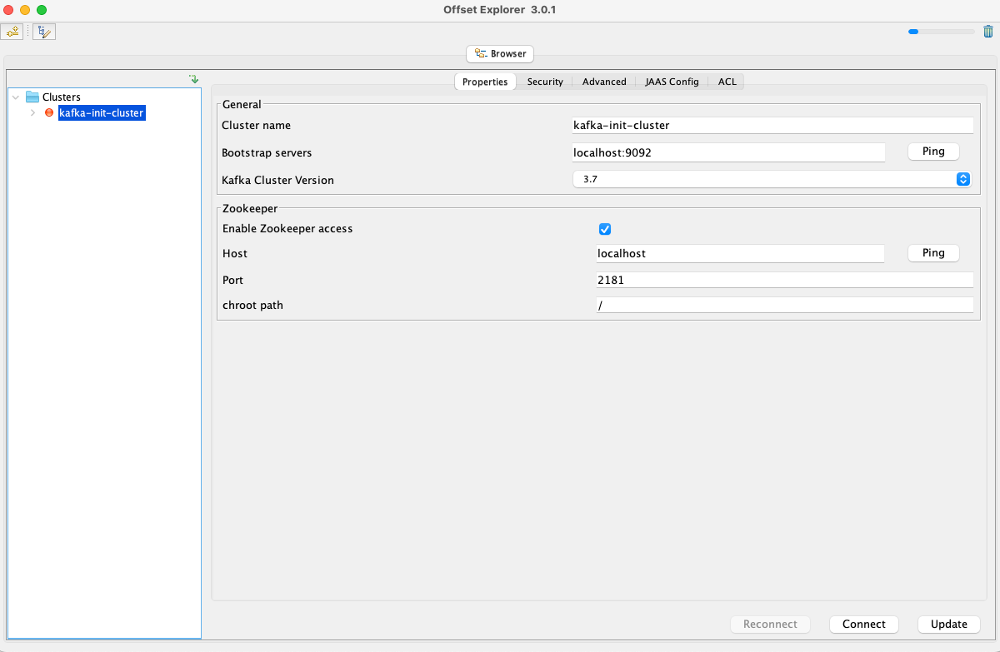
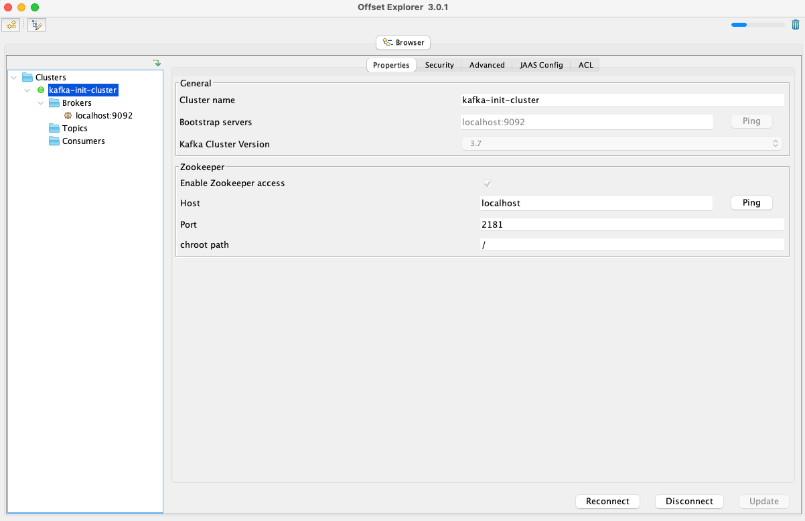
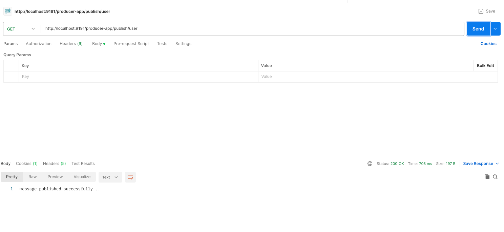
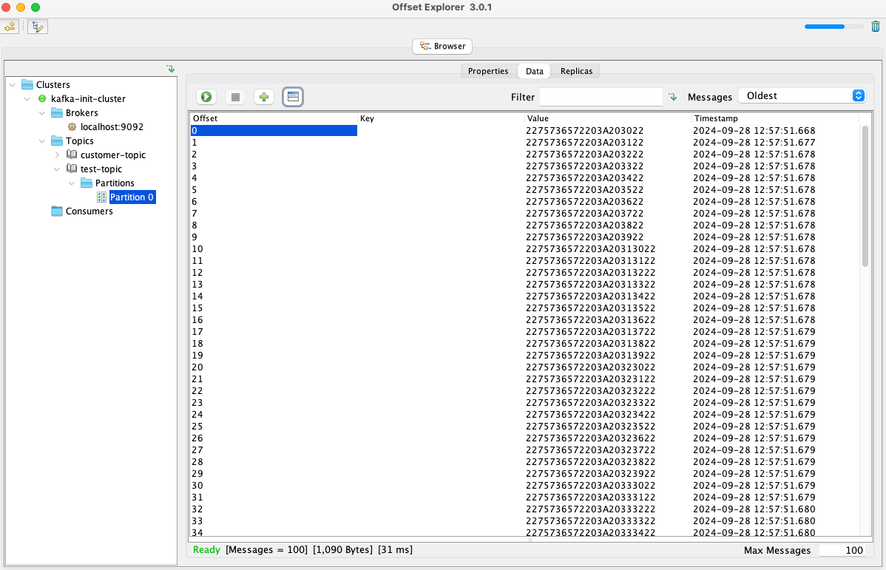

# kafka-producer-example

# documents

## Open Source Kafka Startup in local ##

1. Start Zookeeper Server

    ```sh bin/zookeeper-server-start.sh config/zookeeper.properties```

2. Start Kafka Server / Broker

    ```sh bin/kafka-server-start.sh config/server.properties```

3. Create topic

    ```sh bin/kafka-topics.sh --bootstrap-server localhost:9092 --create --topic NewTopic --partitions 3 --replication-factor 1```

4. list out all topic names

    ``` sh bin/kafka-topics.sh --bootstrap-server localhost:9092 --list ```

5. Describe topics
  
    ``` sh bin/kafka-topics.sh --bootstrap-server localhost:9092 --describe --topic NewTopic ```

6. Produce message

    ```sh bin/kafka-console-producer.sh --broker-list localhost:9092 --topic NewTopic```


7. consume message

    ``` sh bin/kafka-console-consumer.sh --bootstrap-server localhost:9092 --topic NewTopic --from-beginning ```


## Confluent Kafka Community Edition in local ##

1. Start Zookeeper Server

    ```bin/zookeeper-server-start etc/kafka/zookeeper.properties```

2. Start Kafka Server / Broker

    ```bin/kafka-server-start etc/kafka/server.properties```

3. Create topic

    ```bin/kafka-topics --bootstrap-server localhost:9092 --create --topic NewTopic1 --partitions 3 --replication-factor 1```

4. list out all topic names

    ``` bin/kafka-topics --bootstrap-server localhost:9092 --list ```

5. Describe topics
  
    ``` bin/kafka-topics --bootstrap-server localhost:9092 --describe --topic NewTopic1 ```

6. Produce message

    ```bin/kafka-console-producer --broker-list localhost:9092 --topic NewTopic1```


7. consume message

    ```bin/kafka-console-consumer --bootstrap-server localhost:9092 --topic NewTopic1 --from-beginning ```
    
8. Send CSV File data to kafka    

   ```bin/kafka-console-producer --broker-list localhost:9092 --topic NewTopic1 <bin/customers.csv```

## Offset explorer





After running the spring boot application, the topic and partition has created based on the configuration defined in the /config package


## Execution or Testing
1. Run GET call in postman



2. Test topic has created with default partition and messages or data has been assigned

